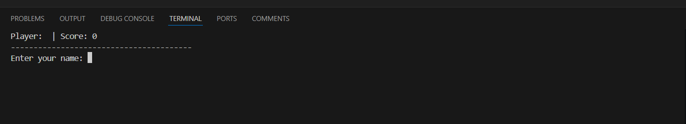
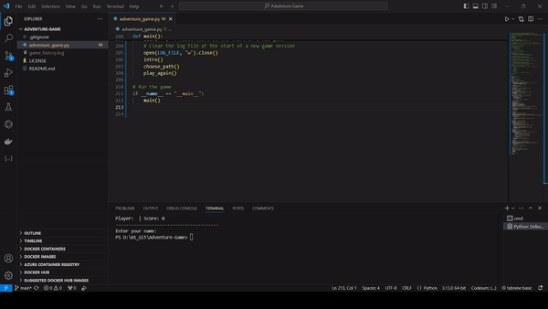

# Adventure-Game
# Adventure Game

## 1. Project Overview

This is a simple text-based adventure game written in Python. Players navigate through different scenarios, making choices that influence their journey.
The game features various paths, random events, and different outcomes, providing a unique experience each time it is played.
The player’s name and score are always displayed at the top of the console for added immersion.
The game includes features such as:

- Interactive choices that affect the game's outcome.
- A scoring system that tracks player progress.
- Logging of player names and final scores, with timestamps.
- A dynamic top display showing the player's current name and score.
- Random events to create varied gameplay experiences.

  
*Figure 1: Gameplay showing the top display with player name and score.*

---

## 2. Code Review Checklist

The following checklist shows the criteria met by the project:

- [x] **Output text to the console.**  
      Descriptions are printed to the console for the player to see.
- [x] **Import modules and use functions from those modules.**  
      Uses `time`, `random`, `datetime`, and `os` modules in the game.
- [x] **The `time.sleep` function is used to create delays between messages.**  
      Delays between messages are used to enhance the gameplay experience.
- [x] **The `random.choice` or `random.randint` function is used.**  
      Random outcomes determine different game events.
- [x] **Use the `input` function with conditional statements to create an interactive program.**  
      Player input affects game progression, such as choosing paths or actions.
- [x] **The player's choices affect what happens in the game.**  
      Choices determine outcomes, including winning, losing, or restarting.
- [x] **Use a conditional loop to handle invalid input.**  
      The game provides prompts for retrying invalid inputs until a valid option is given.
- [x] **The game does not crash or treat invalid input as a valid choice.**  
      The game safely handles invalid input by prompting the player again.
- [x] **Refactor code by defining and calling functions.**  
      The code includes multiple functions, each with a single responsibility to reduce repetition and improve readability.
- [x] **Write code that follows the standard Python style guide.**  
      The `pycodestyle` tool reports zero errors and zero warnings.
- [x] **Test code and produce an error-free program.**  
      The game is playable, runs from start to finish, and handles all scenarios without crashing.

---

## 3. Notes on Work

During development, the following features and improvements were added:
- **Score Tracking**: A scoring system was implemented to keep the game engaging and rewarding.
- **Logging System**: Game logs include the player's name, final score, and timestamp when the game ends, which helps track gameplay history.
- **Dynamic Top Display**: The player’s name and score are always shown at the top of the console, while other messages are displayed one at a time with a 1-second delay and then cleared.
- **Code Refactoring**: Functions were used to reduce code repetition and improve readability.
- **Input Handling**: The game ensures that only valid inputs are accepted, with prompts for retrying in case of invalid choices.

Challenges:
- **Dynamic Console Update**: Implementing the constant top display while clearing other text required careful management of console output and timing.
- **Randomized Events**: Ensuring that different outcomes were both fair and interesting involved balancing the randomness and the scoring system.

Configuration:
- The game runs in a standard Python environment. No additional packages are required, but the terminal must support console clearing (e.g., `cls` for Windows, `clear` for Unix/Linux/Mac).

---

## 4. Adding a GIF

To show a demo of the gameplay with the dynamic top display and message clearing, add a GIF that captures the console interactions.

  
*Figure 2: GIF demonstrating the dynamic top display and gameplay in action.*

---

### Additional Information

- **Log File**: The game creates a log file named `game_history.log` to record player names, scores, and timestamps for completed games.
- **Replayability**: The game prompts players to restart or exit after each playthrough, ensuring continuous engagement.
- **Customizable Settings**: Players can easily modify the game's scenarios or scoring rules by adjusting the relevant functions in the code.

Feel free to expand on any sections as needed to provide more details.
